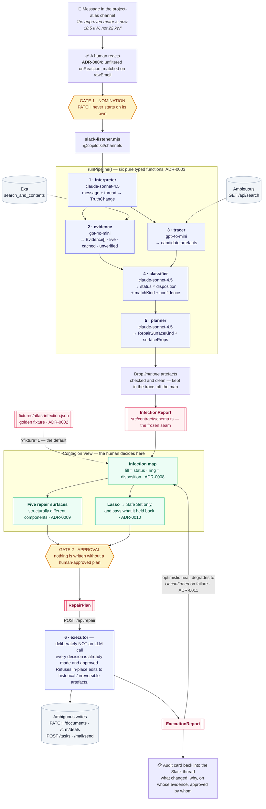
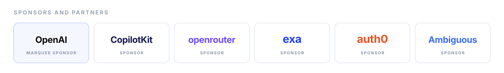

# PATCH

### When truth changes, patch everywhere it spread.

Every organisation has one source of truth and hundreds of copies of yesterday's truth.
The dangerous part isn't that a fact changed — it's that the old fact is still alive in
a draft proposal, a CRM record, an open task, and an email you already sent.

PATCH detects a truth change where it actually happens — a Slack message someone reacts
to with 🩹 — finds everywhere the old value spread, and **generates a different repair
interface for every affected artefact**. Repairing a draft, a CRM field, a dependent
engineering task, an already-sent customer email, and a historical as-built record are
five different problems, and PATCH refuses to pretend otherwise.

> **Codependents presents PATCH. React 🩹 when reality changes.**

**Live docs → [patch-agent-zeta.vercel.app](https://patch-agent-zeta.vercel.app)**  ·  source in [`site/`](site/)

---

## The scenario

A supplier revises the Project Atlas drive motor from **22 kW → 18.5 kW**. Six workspace
artefacts carry the old value:

| Artefact | Carries it how | What PATCH may do |
| --- | --- | --- |
| Commercial proposal (draft) | Literally, twice | Safe to fix |
| CRM deal record | In a structured field | Safe to fix |
| Technical specification | Literally — but at 62% confidence | **Your call** — may be a different motor |
| Cable-sizing task | Never says it; was *derived* from it | **Your call** — who checks the knock-on work |
| Email already sent to the customer | Literally, and they've read it | **Cannot be quietly fixed** — correction only |
| Orion as-built record (2024) | Literally, and correctly so | **Must stay as it is** — annotate only |

Knowing the difference between those six is the product.

---

## Architecture



**Every model call routes through OpenRouter** with a per-agent model map in
[`src/lib/models.ts`](src/lib/models.ts) — cheap and fast for extraction, stronger for
the judgement work where the historical-vs-irreversible distinction is actually decided
(ADR-0005). The model id that really ran is recorded in each `AgentTraceEntry` and shown
in the trace panel, so what ran is *visible on stage* rather than claimed.

### The two gates

PATCH does not start on its own, and it does not write without a human-approved plan.
Both are deliberate product constraints, not unimplemented features (ADR-0006). We
explicitly rejected passive channel monitoring: it demos as clever for ten seconds and
then reads as an agent that will rewrite your CRM because somebody said *"actually,
let's meet at 10"*.

### The five repair surfaces

Selected from the artefact's kind and disposition. They share **no layout frame** — if
two of them look like the same modal with different text, the product's argument is dead
(ADR-0009).

| Surface | Generated when | What it does |
| --- | --- | --- |
| **Document Diff** | Editable prose containing the stale literal | Before/after, accept · rewrite · skip |
| **Field Change** | A structured record field | Record row, source badge, connected opportunities |
| **Dependency Decision** | Exposed artefact whose downstream work may break | Impact statement, assignee, urgency |
| **Corrective Message** | Irreversible — already delivered to someone | **No apply control exists.** Recipients + drafted correction |
| **Preservation Notice** | Historical — must not change | **No edit control exists.** Text locked, annotation only |

The last two *visibly refuse* to do the normal thing. That refusal is the thesis.

---

## Quickstart

```bash
git clone https://github.com/thanmai670/PATCH.git && cd PATCH
claude          # then type:  /start
```

`/start` installs the skills and dependencies, boots the dev server, loads the domain
context, and drives the grill → ADRs → spec → tickets → implement flow.

Manual equivalent:

```bash
npm install
cp .env.example .env.local     # every key may stay blank
npm run dev                    # http://localhost:3000
```

The UI boots against `fixtures/atlas-infection.json` and renders fully **with no API
keys and no network**. That is deliberate (ADR-0002) — and it is also the demo fallback.
`?fixture=0` switches to live agent output once the pipeline has run.

### Running the live pipeline

```bash
npm run seed                   # seed the Ambiguous workspace
npm run listener               # Slack listener — react 🩹 to trigger a run
npx tsx --env-file=.env.local scripts/run-pipeline.ts --save
npm run test:repair            # exercise every repair scenario
npm run typecheck              # tsc --noEmit
```

### Environment

| Key | Used for |
| --- | --- |
| `OPENROUTER_API_KEY` | Every model call — the only model secret (ADR-0005) |
| `EXA_API_KEY` | External evidence |
| `AMBIGUOUS_API_KEY` · `AMBIGUOUS_BASE_URL` | The workspace that actually gets written to |
| `COPILOTKIT_API_KEY` · `NEXT_PUBLIC_COPILOTKIT_URL` | Generative UI and Slack Channels |
| `SLACK_BOT_TOKEN` · `SLACK_SIGNING_SECRET` · `SLACK_DEMO_CHANNEL` | The 🩹 trigger and audit cards |

---

## Project layout

```
src/
  contract/schema.ts      ← the frozen seam between the two workstreams
  agents/                 ← six pure typed functions + runPipeline
  adapters/               ← Exa, Ambiguous
  channels/               ← Slack nomination predicate, cards, authz
  lib/                    ← OpenRouter client, per-agent model map, report loading
  components/contagion/   ← the Contagion View
    InfectionMap.tsx        radial map, drag, lasso, ripple, zoom
    ArtefactList.tsx        the readable list — works without the map
    surfaces/               five structurally distinct repair surfaces
  app/api/                ← /api/report/[id], /api/repair
fixtures/                 ← the golden InfectionReport
docs/adr/                 ← eleven decisions and why
```

## Read before writing code

- [`CONTEXT.md`](CONTEXT.md) — the vocabulary. Use it in code, issues, UI, and on stage.
- [`docs/ARCHITECTURE.md`](docs/ARCHITECTURE.md) — the six agents and how they connect.
- [`docs/adr/`](docs/adr/) — eleven decisions. **ADR-0001** and **ADR-0004** will each save you an hour.
- [`docs/DEMO-RUNBOOK.md`](docs/DEMO-RUNBOOK.md) — the 90-second script and the fallbacks.

| Workstream | Owner | Doc |
| --- | --- | --- |
| **A** — agents, Exa, Ambiguous, Slack | Thanmai | [`docs/WORKSTREAM-A.md`](docs/WORKSTREAM-A.md) |
| **B** — Contagion View, repair surfaces | Yamini | [`docs/WORKSTREAM-B.md`](docs/WORKSTREAM-B.md) |

The seam between them is [`src/contract/schema.ts`](src/contract/schema.ts).
**Neither person edits it alone.**

## Stack

Next.js 16 · TypeScript · React 19 · Tailwind · CopilotKit (generative UI + Channels for
Slack) · OpenRouter (every model call) · Exa (external evidence) · Ambiguous (the
workspace that actually gets written to) · Zod (the contract).

---

## Sponsors and partners

<p align="center">
  
</p>

<p align="center">
  <a href="https://openai.com">OpenAI</a> ·
  <a href="https://copilotkit.ai">CopilotKit</a> ·
  <a href="https://openrouter.ai">OpenRouter</a> ·
  <a href="https://exa.ai">Exa</a> ·
  <a href="https://auth0.com">Auth0</a> ·
  <a href="https://ambiguous.ai">Ambiguous</a>
</p>
